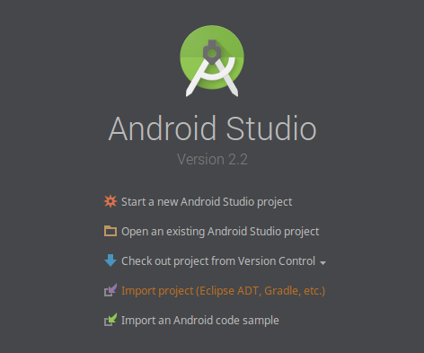

# kakava
Customizable Android app template generator. This tool allows you to generate an empty Android project with default/your own template. Checkout `templates/default/` or `templates/default-kotlin/` for more info.

## Motivations
I've noticed that I spend ~15 minutes each time, when I need to create and set up a project for a new app or a prototype. Well, need to do a task more than once? Automate it! So, meet kakava!

## Requirements
* `python3`

## Download
Clone the repo:
```
git clone --branch v1.3 git@github.com:rozag/kakava.git YOUR_PATH/kakava
```
For convenience add it to your PATH. Put it to your `~/.bashrc`:
```
PATH=$PATH:YOUR_PATH/kakava
```

## Sample usage
* Super quick start (default project in current directory)
```
kakava
```
* Quick start
```
kakava -d NEW_PROJECT_PATH
```
* Custom package and app name
```
kakava -d NEW_PROJECT_PATH -n MyApp -p com.example.app
```
* Kotlin Android project
```
kakava -d NEW_PROJECT_PATH -n MyApp -p com.example.app -t default-kotlin
```
* Open it with AndroidStudio Import project option


* `kakava -h`
```
usage: kakava [-h] [-d DESTINATION] [-p PACKAGE] [-n NAME] [-t TEMPLATE]

optional arguments:
  -h, --help            show this help message and exit
  -d DESTINATION, --destination DESTINATION
                        output directory for the app
  -p PACKAGE, --package PACKAGE
                        package name, e.g. com.example.app
  -n NAME, --name NAME  app name, e.g. MyApp
  -t TEMPLATE, --template TEMPLATE
                        template directory name in the templates/ dir
```

## Out-of-the-box templates
* `default` - [default template](https://github.com/rozag/kakava/blob/master/templates/default/README.md) for Java Android app
* `default-kotlin` - [default template for Kotlin](https://github.com/rozag/kakava/blob/master/templates/default-kotlin/README.md) Android app

## How can I add my own template?
Basically, what kakava does is iterate over all `*.kakava` files in the template and replace each variable substitution with desired value from the CLI params. See [currently supported variables](#currently-supported-params). Therefore to create new template you should:
 1. Create and configure your desired project setup
 2. Replace package names, class names or whatever you want with the `${variableName}` substitution
 3. Add the `.kakava` extension to all files with such replacements
 4. Reduce your `com/whatever/product` folder hierarchy to a simple `kakavaroot` folder
 5. Put your new template into `templates/` folder with the desired name (e.g. `my-awesome-template`)
 6. Smile, you're awesome :)

## Currently supported params
* `${packageName}` - the package name for your app (e.g. `com.company.product`)
* `${appName}` - your application name (e.g. `MyApp`)

## TODO (PR welcome)
* Better custom templates support (custom CLI params parsing)
* Advanced kotlin project template (advanced-kotlin)
* Hackathon kotlin project template (hack-kotlin)
* Centralized source of libraries' versions

## License

    Copyright 2017 Alexey Mileev

    Licensed under the Apache License, Version 2.0 (the "License");
    you may not use this file except in compliance with the License.
    You may obtain a copy of the License at

       http://www.apache.org/licenses/LICENSE-2.0

    Unless required by applicable law or agreed to in writing, software
    distributed under the License is distributed on an "AS IS" BASIS,
    WITHOUT WARRANTIES OR CONDITIONS OF ANY KIND, either express or implied.
    See the License for the specific language governing permissions and
    limitations under the License.